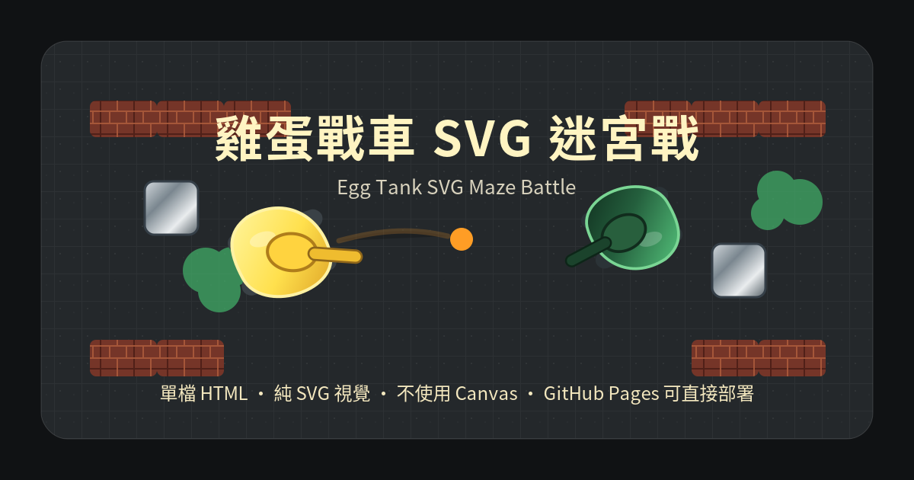
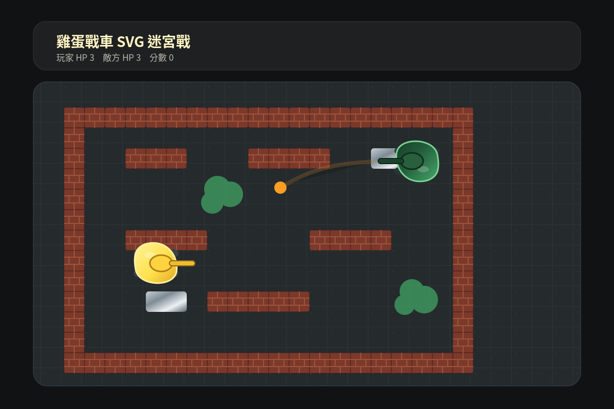

# 雞蛋戰車 SVG 迷宮戰



一款使用 **HTML + CSS + JavaScript + SVG** 製作的俯瞰式迷宮戰車網頁遊戲。  
主角不是傳統坦克，而是兩台可愛的 **雞蛋風格戰車**：玩家操作明亮檸檬黃蛋車，在深灰磨砂戰場中對抗森林綠敵方蛋車。

這個專案的目標是示範：不使用 Canvas、不使用外部圖片、不使用任何前端框架，也能用原生 SVG 做出可互動、可縮放、具備遊戲感的網頁小遊戲。

---

## 線上遊玩

如果你已經啟用 GitHub Pages，可以把下面網址換成你的 repository 網址：

```text
https://<你的 GitHub 帳號>.github.io/<repository-name>/
```

例如 repository 名稱是 `egg-tank-svg-game`，GitHub Pages 網址通常會類似：

```text
https://<你的 GitHub 帳號>.github.io/egg-tank-svg-game/
```

---

## 遊戲畫面



---

## 操作方式


| 操作 | 按鍵 |
|---|---|
| 向上移動 | `W` 或 `↑` |
| 向下移動 | `S` 或 `↓` |
| 向左移動 | `A` 或 `←` |
| 向右移動 | `D` 或 `→` |
| 發射炮彈 | `Space` |
| 炮塔瞄準 | 滑鼠移動 |
| 重新開始 | 點擊畫面中的重新開始按鈕 |

---

## 遊戲特色

- **純 SVG 視覺核心**：戰車、炮塔、炮彈、牆面、鋼塊、灌木、粒子與爆炸效果皆由 SVG 繪製。
- **不使用 Canvas**：方便學習 SVG DOM、CSS 動畫與 JavaScript 互動控制。
- **單檔可執行**：主要遊戲邏輯集中於 `index.html`，下載後可直接開啟遊玩。
- **俯瞰迷宮戰場**：使用格子地圖設計，包含磚牆、鋼塊與灌木障礙。
- **雞蛋風格戰車**：蛋形車體、履帶、炮塔與高光邊緣，兼具可愛與街機遊戲感。
- **敵方 AI**：敵方蛋車會巡邏、轉向、瞄準玩家並定時射擊。
- **互動動畫**：包含履帶滾動、塵土粒子、炮彈發光、爆炸粒子、受擊閃爍與蛋殼裂痕效果。
- **GitHub Pages 友善**：不需要建置流程、不需要後端、不需要套件管理器。

---

## 技術棧

| 類別 | 使用技術 |
|---|---|
| 結構 | HTML5 |
| 樣式 | CSS3 |
| 互動 | Vanilla JavaScript |
| 視覺核心 | SVG |
| 動畫 | CSS Animation + JavaScript + `requestAnimationFrame` |
| 部署 | GitHub Pages / 任意靜態網站空間 |

---

## 快速開始

### 方法一：直接下載開啟

1. 下載本專案 ZIP。
2. 解壓縮。
3. 用瀏覽器開啟 `index.html`。
4. 開始遊玩。

### 方法二：使用 Git Clone

```bash
git clone https://github.com/<你的 GitHub 帳號>/<repository-name>.git
cd <repository-name>
```

接著直接用瀏覽器開啟：

```text
index.html
```

也可以使用 VS Code 的 Live Server 或任何靜態伺服器預覽。

---

## GitHub Pages 部署方式

本專案是純靜態網頁，因此很適合直接使用 GitHub Pages。

### 1. 建立 GitHub Repository

建議 repository 名稱可使用：

```text
egg-tank-svg-game
```

### 2. 上傳檔案

請確認 repository 根目錄至少包含：

```text
.
├── index.html
├── README.md
├── LICENSE
├── .nojekyll
└── assets/
    ├── cover.png
    ├── cover.svg
    ├── gameplay-preview.png
    ├── gameplay-preview.svg
    ├── controls.png
    └── controls.svg
```

### 3. 啟用 GitHub Pages

進入 GitHub repository 後：

1. 點選 **Settings**
2. 左側選單點選 **Pages**
3. 在 **Build and deployment** 區塊中選擇：
   - Source：`Deploy from a branch`
   - Branch：`main`
   - Folder：`/root`
4. 按下 **Save**
5. 等待 GitHub Pages 完成部署

部署完成後，GitHub 會顯示你的遊戲網址，通常格式會是：

```text
https://<你的 GitHub 帳號>.github.io/<repository-name>/
```

---

## 檔案結構

```text
.
├── index.html              # 遊戲主程式，包含 HTML、CSS、SVG 與 JavaScript
├── README.md               # 專案說明文件
├── LICENSE                 # 開源授權條款
├── .nojekyll               # 讓 GitHub Pages 以一般靜態檔案方式發布
└── assets/
    ├── cover.png           # README 封面圖
    ├── cover.svg           # README 封面圖 SVG 來源
    ├── gameplay-preview.png # 遊戲畫面預覽圖
    ├── gameplay-preview.svg # 遊戲畫面預覽圖 SVG 來源
    ├── controls.png        # 操作說明圖
    └── controls.svg        # 操作說明圖 SVG 來源
```

---

## 遊戲規則

- 玩家操作檸檬黃雞蛋戰車。
- 敵方為森林綠雞蛋戰車。
- 玩家與敵方都有生命值。
- 玩家可以在迷宮中移動，但不能穿越磚牆與鋼塊。
- 灌木具有半透明遮蔽效果。
- 玩家可使用 `Space` 發射炮彈。
- 敵方會自動移動、瞄準並射擊。
- 擊中敵方可扣除敵方生命值並增加分數。
- 玩家生命值歸零時，遊戲結束。
- 敵方生命值歸零時，玩家勝利。

---

## SVG 設計重點

這個遊戲刻意以 SVG 作為核心，適合拿來研究以下主題：

- SVG `viewBox` 與可縮放畫面設計
- SVG `defs`、`pattern`、`linearGradient`、`filter`
- 以 SVG group `<g>` 組合角色元件
- 使用 JavaScript 動態建立與更新 SVG DOM
- 使用 `transform` 控制角色位置與旋轉
- 使用 `requestAnimationFrame` 製作遊戲迴圈
- 使用 CSS Animation 製作履帶滾動與受擊特效
- 使用粒子系統表現塵土、炮口閃光與爆炸

---

## 可調整項目

你可以在 `index.html` 中調整下列遊戲參數：

| 項目 | 說明 |
|---|---|
| `CELL` | 地圖格子大小 |
| `baseMap` | 迷宮地圖配置 |
| `MAX_HP` | 玩家與敵方生命值 |
| `player.speed` | 玩家移動速度 |
| `enemy.speed` | 敵方移動速度 |
| `fireCooldown` | 射擊冷卻時間 |
| `bullet.speed` | 炮彈速度 |

地圖代號：

| 代號 | 意義 |
|---|---|
| `0` | 空地 |
| `1` | 紅褐色磚牆 |
| `2` | 銀灰色鋼塊 |
| `3` | 翠綠色灌木 |

---

## 開發方向 / Roadmap

未來可以加入：

- 手機觸控操作
- 多關卡地圖
- 更多敵方雞蛋戰車
- 可破壞磚牆
- 道具系統，例如補血、加速、護盾
- 音效與背景音樂
- 分數排行榜
- 雙人對戰模式
- 更完整的敵方尋路 AI
- PWA 離線遊玩支援

---

## 貢獻方式

歡迎 fork 本專案並提交 Pull Request。  
如果你想改造這個遊戲，可以從以下方向開始：

- 新增地圖
- 優化敵方 AI
- 增加 SVG 動畫細節
- 加入手機操作
- 改善碰撞判定
- 加入音效
- 製作更多雞蛋戰車造型

---

## 授權

本專案採用 MIT License。  
你可以自由使用、修改、散布與改作，但請保留原始授權聲明。

---

## 作者備註

這是一個以「SVG 也能做遊戲」為核心概念的小型實驗專案。  
它不追求大型遊戲引擎的完整性，而是展示原生 Web 技術如何透過簡潔的結構完成一個可玩、可讀、可部署的小遊戲。
